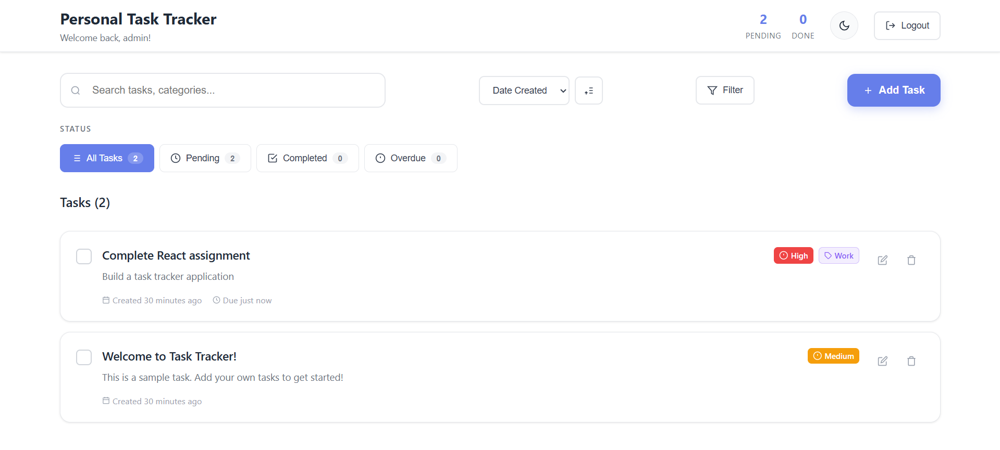
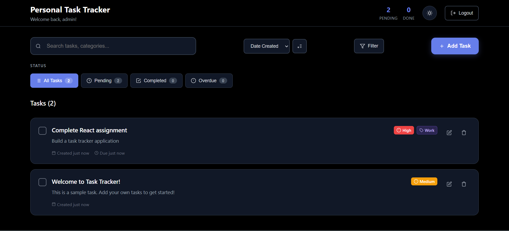
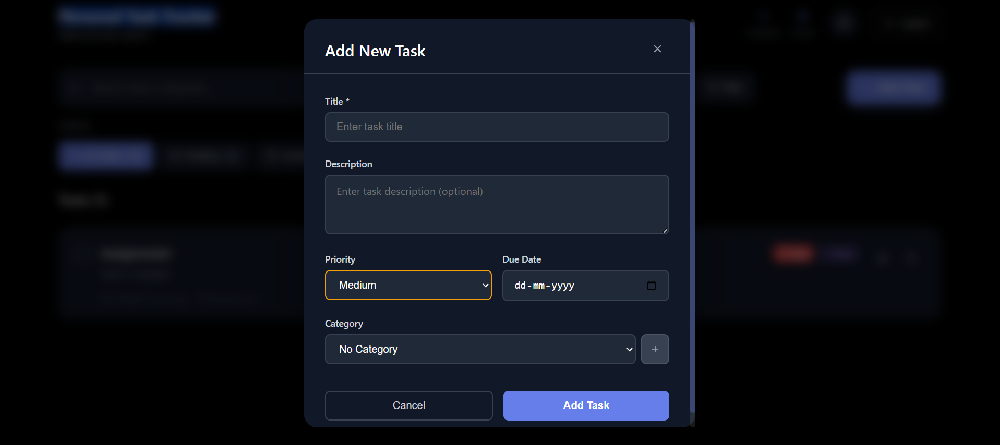
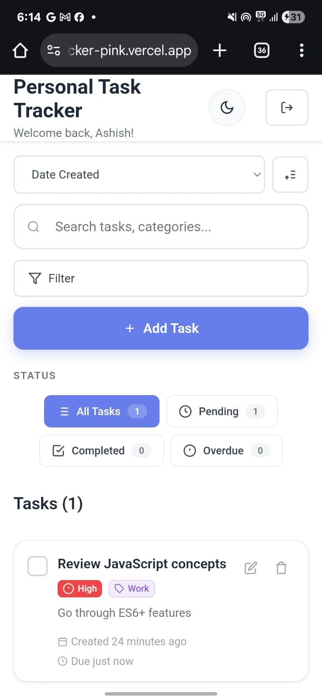

# Personal Task Tracker

## 📖 Description

A modern, responsive task management application built with React.js that helps you organize your daily tasks efficiently. Features a clean interface with dark/light mode support, priority-based task organization, category management, and persistent local storage to keep your tasks safe across browser sessions.

## 🚀 Features

- *Task Management*
  - ✅ Create, edit, and delete tasks
  - ✅ Mark tasks as complete/incomplete
  - ✅ Add detailed descriptions to tasks
  - ✅ Set due dates with overdue indicators

- *Organization & Filtering*
  - 🏷 Categorize tasks (Work, Personal, Shopping, Health, Custom)
  - 🎯 Set priority levels (High, Medium, Low)
  - 🔍 Search tasks by title, description, or category
  - 📊 Filter by status, priority, category, and overdue tasks
  - 📈 Sort by date, title, priority, due date, or category

- *User Experience*
  - 🌙 Dark/Light mode toggle with persistence
  - 📱 Fully responsive design for all devices
  - 💾 Automatic data persistence with localStorage
  - 🎨 Modern, clean UI with smooth animations
  - 🔔 Toast notifications for user feedback

- *Authentication*
  - 👤 Simple username-based login system
  - 🔒 User session persistence across browser refreshes

## 🛠 Setup Instructions

1. *Clone the repository*
   ```bash
   git clone git clone https://github.com/your-username/personal-task-tracker.git
   cd personal-task-tracker
   ```
   

2. *Install dependencies*
   ```bash
   npm install
   ```
   

3. *Start the development server*
   ```bash
   npm start
   ```
   

4. *Open your browser*
   Navigate to [http://localhost:3000](http://localhost:3000)

5. *Start using the app*
   - Enter any username to login
   - Start adding and managing your tasks!

## 🧰 Technologies Used

- *Frontend Framework:* React.js (Functional Components + Hooks)
- *Styling:* CSS3 with custom responsive design
- *State Management:* React built-in state (useState, useEffect)
- *Data Persistence:* Browser localStorage API
- *Notifications:* react-hot-toast
- *Icons:* Lucide React (SVG icons)
- *Build Tool:* Create React App
- *Package Manager:* npm

## 🎯 Key Features Implemented

### React Concepts Used
- ✅ Functional Components with Hooks
- ✅ useState for state management
- ✅ useEffect for side effects
- ✅ useRef for DOM references
- ✅ Props and prop drilling
- ✅ Event handling
- ✅ Conditional rendering
- ✅ List rendering with keys
- ✅ Form handling and validation

### Advanced Features
- ✅ Lazy state initialization
- ✅ Custom event handlers
- ✅ Data persistence with localStorage
- ✅ Responsive design patterns
- ✅ Theme switching functionality
- ✅ Search and filter implementation
- ✅ Sorting algorithms
- ✅ Export functionality
- ✅ Toast notifications
- ✅ Modal dialogs

## 🔗 Live Demo

https://personal-task-tracker-pink.vercel.app/

## 🖼 Screenshots

### Light Mode Dashboard  
  


### Dark Mode with Task Form


### Dark Mode with Task Form


### Mobile Responsive View

